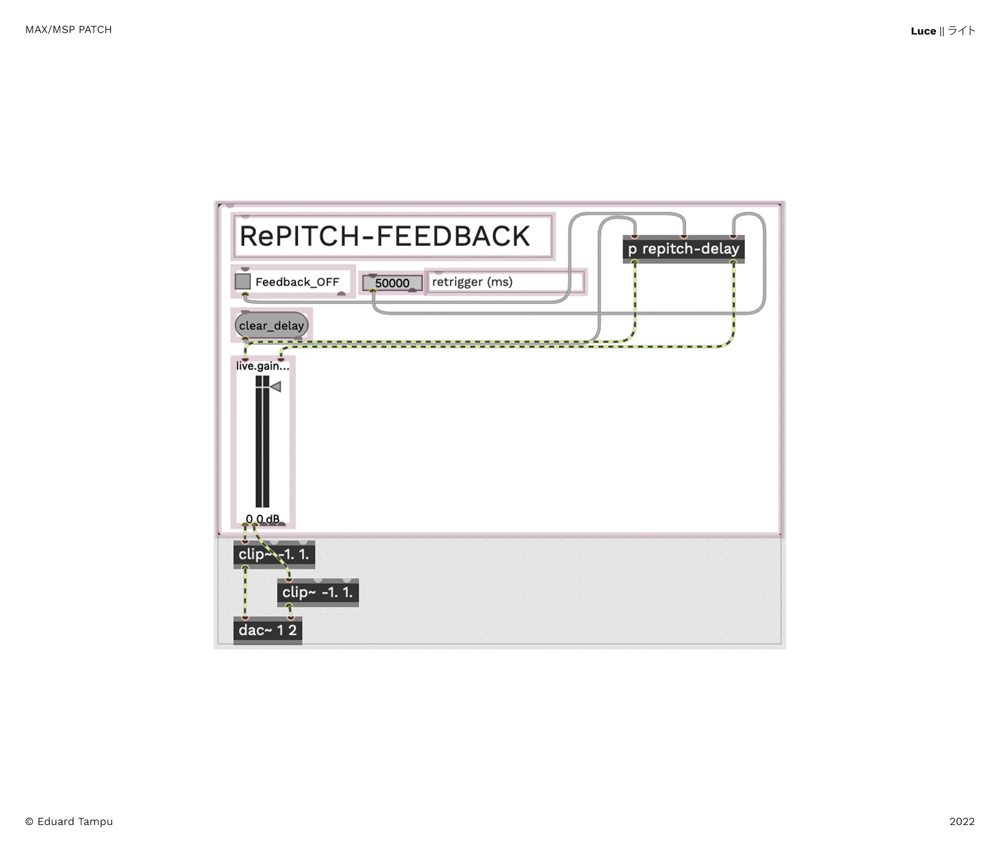

# LUCE

## Rethinking physicality

### From the inside to the outside

This project was idealised and produced during the course ‘Composing with New Musical Instruments’ at Aalto University in November 2022. 

To begin with, one of my main points was designing an instrument that could be used in different contests with different purposes, focusing on the possible applications. The idea was to re-think the use of a familiar instrument to me, the saxophone, by imagining new ways of performing with this instrument, looking to its physicality with a different perspective. 

The adopted approach was more focused on the realisation of an interface that relies on the saxophone as ‘building surface’ that I could use for multiple purposes (meaning for his different use during a performance).

After few iterations, I was intrigued by the idea of thinking of the instrument *from the inside to the outside*, as the immaterial sound produced that flows to the outside from inside the instrument. The slow move of the keys in the instrument produces slight variations in pitch, change in the timber to some extend, but more relevant is the way the player is required to think of the way he treats the instrument. This slow control can be very hard, since the keys of the instrument itself have some resisting force, and in order to produce a very small variation on the aperture of a certain key, the player has to be even more aware of his body (especially the fingers used to control the behave of a key).

Then, I realised that I could track those movements ‘rethinking’ the immateriality of sound, that flows from the inside to the outside, thanks to the use of light. By placing an led-strip inside the instrument (like is done by the technicians when checking this instrument) is possible to see if a key is ‘leaking’, and for the purpose of this project, is possible to see how much a key is opened/closed. Thus, thanks to the use of LDR sensors (light dependent resistors) is possible to represent with datas this particular events. 

## What was used

The course previously mentioned, has made available [Bela](https://bela.io) boards for the realisation of the  instruments of the participants. This tool was used in order to interprete the analog signals of the sensors inside a programming environment (in this case [Pure Data](http://puredata.info)). In this case, the Bela board and the mentioned programming environment are used in order to retrive the informations from the sensors and send them via [OSC](https://en.wikipedia.org/wiki/Open_Sound_Control) to [Max/MSP](https://cycling74.com/products/max). A mobile phone was used with the [ZIG SIM PRO](https://1-10.github.io/zigsim/getting-started.html) by 1→10 application, placed on the saxophone with some velcro, retrieving accelerometer, gyroscope, quaternion and gravity informations.

From the more physical side, this first prototype was realised with 8 LDR sensors, each one wired with a cable (the construction which will be explained later) that can be plugged and unplugged to a prefboard with the designed circuit. 

## The construction

The first step, was realising a prototype through the use of a breadboard that could be then translated to a more stable and usable prototype. The resistors used are 10KΩ.


From this, the realisation of a diagram that helps realising a prototype that already can be used to perform:


A prefboard is used in order to create a stable interface for the sensors, designed with multi-pin connection heads, in order to create a more flexible system in which was possible to easily replace eventually broken cables:

Note. An acrylic pice is placed on the bottom (the soldered side) of the prefboard in order to protect the connections.


Then, the following was creating a cable that could hold each LDR sensor. An important feature of this step, is that the cable needs to be rigid enough for the user to be able to model and place it on the instrument. 

The cable is constructed by five elements: the (1) LDR sensor is soldered to the extremities of a (2) shielded wire. Each welds is protected by (3) heat shrink tubing, and in order to achieve the right resistance for the cable to hold the position, a (4) metal wire of ø1mm is used [¡]. In order to attach this metal wire to the shielded wire, is used another piece of heat shrinking tubing. The final piece, is a (5) connection head at the end of the cable. The total length of the cable is between 80cm and 90cm (the cables have different dimension between them).

[¡] For the first attempt, was used a ø2mm metal wire, the result was similar, but the resistance of the cable was too high. For other uses, where there is the need for an even more rigidity, ø2mm is the right solution. 


Note. The connection head is not for each cable/LDR. The way this is done is with 4 connectors with 4 pins each. Below is shown how the connections are made:


The last piece designed for this project is a two way snap clip, that could be used in order to place the LDR sensors on the instrument. After some iterations, the result is a clip that can be used for different purposes, even if in the final build, these will be used marginally, due to the movement and instability. 

Note. Further development might produce a perfect tool for this purpose. Already now, this model can be used for different purposes and in different ways in this project.


## System set-up

The system is designed by the combination of the informations coming from the Bela board and the informations received from the ZIG SIM PRO app. It was not used an accelerometer sensor directly connected to the Bela board since even integrating the resulting values those datas were not very useful and more over, the use of this type of sensor requires 3 analog-inputs, ‘stealing’ space to the LDR sensors. 

Below, a general diagram shows what is the set-up for this project:


In order to have a light source, a 3m LED strip was placed inside the instrument, bended multiple times in order to achieve a thicker strip that could sit stably inside the instrument. Then, the LDR sensors are placed on the instrument. In this case was used an Alto Sxophone (Selmer Super Action ‘80 Series II), but the same result can be achieved with all the instruments in the family, changing the dimensions of the wires or adjusting their placement.

For this performance, they were placed on the following keys:

| Key | Sensor Number |
| --- | --- |
| 1 | 1 |
| 2 | 2 |
| 3 | 3 |
| 4 | 4 |
| 5 | 5 |
| 6 | 6 |
| C | 7 |
| Bb | 8 |


Below, can be seen how they are placed on the physical saxophone. As mentioned before, even if a custom clip was printed, the end solution to stably hold the LDRs was using paper tape and velcro stripes.


To conclude, with a velcro stripe, the prefboard is attached to the bell of the saxophone in combination with the mobile phone:


## The Patches

As mentioned, the platform used for this project is Max/MSP, but is important to underline that the project itself relies more on the interface and concept of the instrument rather than the sound itself, meaning that this should be seen more open as a tool that should be used for different performance purposes. 

Below a full view of the patch in presentation mode:


The Bela board (operating a PureData patch) is in a dialogue with Max/MSP thanks to an OSC connection:


Those informations are received and plotted (RAW SENSOR DATA) for the performer, in order to monitor the state of the sensors. Then in order to use such values, a calibration process is designed in order to set all the sensors to the same range (0 and 1). There is also the possibility to set an individual range for each sensor, by changing the minim and maximum value for that particular sensor.


This process is created thanks to a set of [map] objects that receive the original sensor data, the minimum and maximum values decided by the user:


Then the values are used in order to control values inside three sound processes: a Chaotic-Feedback, two sets of [mc.2d.wave] and an Harmonic Pad. To begin with, the first two processes require a sound source to operate with. In the case of the Chaotic-Feedback was used a direct input signal from a microphone, capturing the sound of the saxophone played. The two [mc.2d.wave] instead are accessing two buffers, used to record materials in live. Below is shown the recording subpatch, in which the user can decide: (1) the buffer in which store the informations (2) the dimension of each (or all) the buffers (the purpose of the [js bridge] is similar to a gate, but if given the input -1, it will send the information to all the outputs). This process was used previously in other projects with up to 6 buffers, but in this case I limited the number of buffers. 

Note. The Chaotic-Feedback can also be used with informations stored in a buffer.


Below, the [js bridge] script:

```jsx
autowatch = 1;
outlets = 6;

var a, b, c, d, e, f;

function bridge(x, i) {

     if(i == 1) {
        a = x;
    } if(i == 2) {
        b = x;
    } if(i == 3) {
        c = x;
    } if(i == 4) {
        d = x;
    } if(i == 5) {
        e = x;
    } if(i == 6) {
        f = x;
    }  
    if(i == -1) {
        a = x;
        b = x;
        c = x;
        d = x;
        e = x;
        f = x;
    }

outlet(0, a);
outlet(1, b);
outlet(2, c);
outlet(3, d);
outlet(4, e);
outlet(5, f);
}
```

The Chaotic-Feedback is a patch that is derived from the book “Electronic Music and Sound Design, theory and practice with Max/MSP Vol. 2” by Alessandro Cipriani and Maurizio Giri, making some slight changes for the purpose of this project:


Here, the light sensors are used in order to change the values of the amplitude and offset of the [rand~] signal. Then, the information coming from the gyroscope controls the amplitude of the feedback.

Note. As can be seen in this image, and also in some of the previous, a path is designed in order to control when the LDRs influence a specific part of the patch or for example to start the recording of materials. This is done thanks to a midi controller (in this case) that allows the user to choose when to record or when to allow the sensors to control the various subpatches. 

The second used source is a set of two [mc.2d.wave]. [The object reference](https://docs.cycling74.com/max8/refpages/mc.2d.wave~) describe this as a “Two-dimensional wavetable**”.** “Similar to [wave~](https://docs.cycling74.com/max5/refpages/msp-ref/wave~.html), but with an additional axis. A given ms range of an audio file will be divided into n rows. Y phase input will determine which row(s) will be used for playback.”

In this sense then, the light sensors (activated and deactivated as explained previously) allows the exploration of the X axis and Y axis. Moreover, due to the nature of the [mc] family, we are able to create n(x) channels (in this case 10) and use the propriety [deviate] in order to spread and shift those n(x) channels, creating a even more complex sound experience


The last sound source is an Harmonic Pad, realised once more with the use of the [mc] object family, in order to create a more complex sound result. In this case the light sensors works in order to control the parameters inside a generative system. The 8 lights are used first to set a set of notes inside a [table] and then the octave in which they are located (again thanks to a [table]). The system, working with [mc] modules, at random selects one of the 64 oscillators and assigns one of the values stored in the table. In this system the gyroscope is used to allow the generation of new values in the system (like the starting point for the notes or the rhythmical pattern for the random selection).


To conclude, the sources are feeded inside a Re-Pitch Feedback loop, that creates a more ethereal sound sensation and gives harmonic richness to the final output. This module is not controlled by any external sensor.



